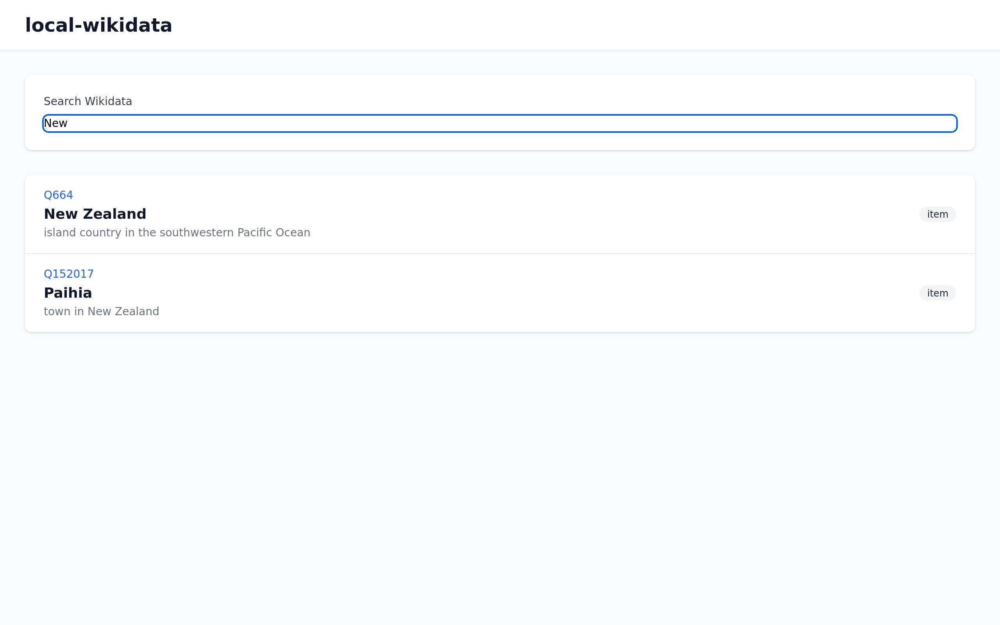

# local-wikidata

Self-hosted Wikidata mirror for personal knowledge bases, AI agents, and offline-first applications.

<p align="center">
  
</p>

## Why?

Wikidata is an incredible structured knowledge base with 100M+ entities. But:

- **Rate limits** — Querying the public API gets throttled
- **Latency** — Every lookup requires a network round-trip
- **Offline** — No internet = no data
- **AI agents** — Making many lookups gets expensive and slow

**local-wikidata** solves this by maintaining a local copy that you control.

## Use Cases

### Personal Knowledge Base

Link your private notes to public knowledge without external dependencies:

```
Your KB: "Nathan lives in Paihia"
         └── Paihia (Q152017) → Bay of Islands → New Zealand → ...
```

Your data stays private. Wikidata provides the public context.

### AI Agent Memory

Give your AI fast access to world knowledge:

```python
# Instead of calling Wikidata API every time
entity = local_wikidata.get("Q152017")  # ~1ms local lookup
```

### Offline Applications

Build apps that work without internet:

- Travel guides
- Educational tools
- Research applications

## Quick Start

### Docker (Recommended)

```bash
# Clone and start
git clone https://github.com/ndbroadbent/local-wikidata
cd local-wikidata
docker compose up -d

# Download and import Wikidata dump (runs in background)
docker compose exec backend task import

# Access the UI
open http://localhost:3000
```

### Local Development

```bash
# Prerequisites: mise, task, uv, bun
mise install
task setup
task dev
```

## Features

- **Idempotent Import** — Resume interrupted imports, no duplicates
- **Full-Text Search** — Fast search across labels and descriptions
- **Write-Through Cache** — Missing entities fetched from API and cached
- **REST API** — Simple JSON API for integration
- **Web UI** — Search and browse entities
- **Docker Ready** — Single command deployment
- **Kubernetes** — Helm chart included

## Architecture

```
┌─────────────────────────────────────────────────────────┐
│                      local-wikidata                      │
├─────────────────────────────────────────────────────────┤
│  Frontend (SvelteKit)                                    │
│  - Search interface                                      │
│  - Entity viewer                                         │
├─────────────────────────────────────────────────────────┤
│  Backend (Python/FastAPI)                                │
│  - REST API                                              │
│  - Import pipeline                                       │
│  - Write-through cache                                   │
├─────────────────────────────────────────────────────────┤
│  Storage (SQLite + FTS5)                                 │
│  - Entities table                                        │
│  - Full-text search index                                │
└─────────────────────────────────────────────────────────┘
           │
           ▼
┌─────────────────────────────────────────────────────────┐
│  Wikidata                                                │
│  - JSON dumps (yearly refresh)                           │
│  - API (cache miss fallback)                             │
└─────────────────────────────────────────────────────────┘
```

## API Reference

### Get Entity

```bash
curl http://localhost:8000/entity/Q152017
```

```json
{
  "id": "Q152017",
  "type": "item",
  "labels": {"en": "Paihia"},
  "descriptions": {"en": "town in New Zealand"},
  "claims": {...}
}
```

### Search

```bash
curl "http://localhost:8000/search?q=new+zealand&limit=10"
```

```json
{
  "results": [
    {"id": "Q664", "label": "New Zealand", "description": "country in Oceania"},
    ...
  ]
}
```

### Stats

```bash
curl http://localhost:8000/stats
```

```json
{
  "total_entities": 110000000,
  "items": 108000000,
  "properties": 12000
}
```

## Configuration

| Variable | Default | Description |
|----------|---------|-------------|
| `DATABASE_PATH` | `./data/wikidata.db` | SQLite database location |
| `DUMP_PATH` | `./data/dump.json.bz2` | Wikidata dump file |
| `API_PORT` | `8000` | Backend API port |
| `FRONTEND_PORT` | `3000` | Frontend port |
| `WIKIDATA_API` | `https://www.wikidata.org/w/api.php` | Fallback API |
| `CACHE_TTL_DAYS` | `365` | Days before re-fetching cached entities |

## Development

```bash
# Run all checks
task ci

# Individual tasks
task format      # Format code
task lint        # Lint code
task typecheck   # Type checking
task test        # Run tests
```

## Deployment

### Docker Compose

See `docker-compose.yml` for production configuration.

### Kubernetes

```bash
helm install local-wikidata ./k8s/helm \
  --set persistence.size=500Gi \
  --set ingress.host=wikidata.example.com
```

## Data

### Downloading Dumps

Wikidata JSON dumps are available at:
https://dumps.wikimedia.org/wikidatawiki/entities/

The `latest-all.json.bz2` file is ~100GB compressed.

### Import Time

On modest hardware (4 cores, 8GB RAM):
- ~1M entities/hour
- Full import: 4-5 days

The import is idempotent and resumable.

## License

MIT

## Credits

- [Wikidata](https://www.wikidata.org/) — The free knowledge base
- [Wikimedia Foundation](https://wikimediafoundation.org/) — For making this data available

---

Built with 🪸 by [Nathan Broadbent](https://github.com/ndbroadbent) and [Reef](https://github.com/reef-ndb)
